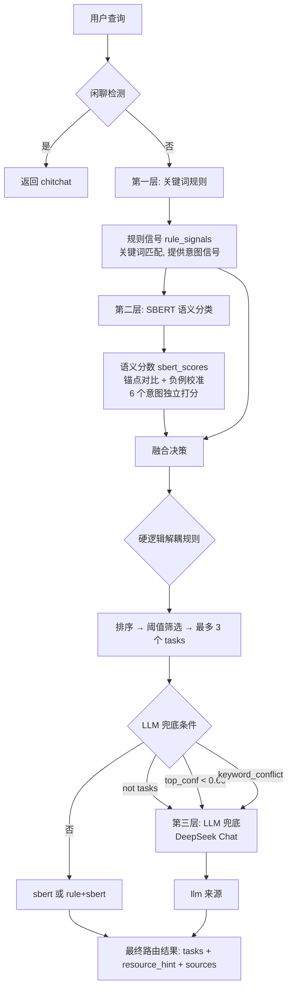

# TaskRouter 三层路由架构



## 三层职责

| 层 | 方法 | 职责 | 输出 |
|----|------|------|------|
| 第一层 | `_rule_match()` | 关键词正则匹配，提供意图信号（不做最终决策） | `rule_signals: List[str]` |
| 第二层 | `_sbert_match()` | 锚点语义对比 + 负例校准，6 个意图独立打分 | `sbert_scores: Dict[str, float]` |
| 融合 | `route()` | 规则信号平滑提权 + 硬逻辑解耦 + 差异化阈值筛选 | `tasks: List[str]` |
| 第三层 | `_llm_fallback()` | DeepSeek Chat 兜底裁决（仅在不确定时调用） | `tasks: List[str]` |

## 融合决策流程

```
规则信号 → 关键词提权(0.27-0.50 → 0.30-0.65)
       → 差异化阈值过滤(retrieve:0.30, summarize:0.50, ...)
       → 硬逻辑解耦(howto/summarize互斥, extract/retrieve消歧)
       → 关键词优先级排序(reason不被howto反超)
       → LLM触发判断
```

## LLM 触发条件（任一）

```python
if not tasks         # 无意图过阈值
   or top_conf < 0.60  # 最高分太低
   or keyword_conflict: # 规则和语义打架
```

## 来源标记

| source | 含义 | 占比 |
|--------|------|------|
| sbert | 仅靠语义分类 | ~50% |
| rule+sbert | 规则+语义融合 | ~45% |
| llm | LLM 兜底裁决 | ~5% |
